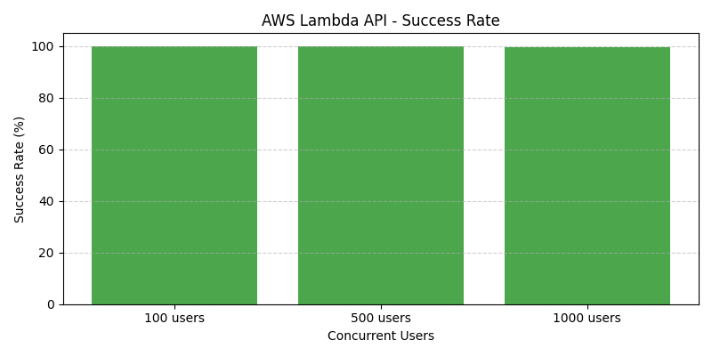

Resumen del proyecto

Este proyecto muestra cómo:

Crear una función AWS Lambda en Python que devuelve JSON.

Empaquetar el código y desplegarlo con AWS CLI.

Exponer la función con API Gateway (REST API).

Probar con Postman / curl.

Ejecutar pruebas de carga con JMeter (100, 500, 1000 usuarios).

Exportar resultados a CSV desde JMeter.

Analizar resultados con analyze_results.py (pandas + matplotlib).

Iterar optimizaciones (aumentar memoria, reservar concurrencia) y comparar.

Archivos clave y su propósito

app.py: código fuente de la Lambda. Punto de entrada app.handler.

function.zip: paquete ZIP con app.py listo para subir a Lambda.

jmeter_plan.jmx: plan de JMeter (opcional, exportado desde GUI).

results_*.csv: archivos exportados por JMeter para cada escenario de carga.

analyze_results.py: script en Python que lee los CSV de JMeter y genera gráficas y un summary.csv.

plots/: carpeta con imágenes PNG generadas por el script.

tests/test_api.py: pruebas automatizadas con pytest y requests.

Código principal (resumido)

app.py (punto de entrada app.handler): funciona con API Gateway (v1/v2) y soporta delay_ms por query param para simular trabajo.

Pasos detallados (desde tu Mac)
0. Requisitos previos

Tener instalado awscli y configurado con un usuario IAM (no root):

aws configure
aws sts get-caller-identity

Tener Python 3.8+ y pip.

Instalar dependencias para análisis local: pandas y matplotlib.

python3 -m pip install pandas matplotlib

Instalar JMeter (por ejemplo con Homebrew):

brew install jmeter
1. Preparar el código local

Crear carpeta de proyecto y archivo app.py con la función handler (se asume app.handler).

Ejemplo de app.py (ya incluido en el repo): función que devuelve JSON y admite delay_ms.

2. Empaquetar el código

Desde dentro de la carpeta del proyecto:

zip -r function.zip app.py

Verificar contenido del ZIP:

unzip -l function.zip
3. Crear rol IAM (si no existe)
aws iam create-role --role-name lambda-basic-execution-role --assume-role-policy-document '{"Version":"2012-10-17","Statement":[{"Effect":"Allow","Principal":{"Service":"lambda.amazonaws.com"},"Action":"sts:AssumeRole"}] }'
aws iam attach-role-policy --role-name lambda-basic-execution-role --policy-arn arn:aws:iam::aws:policy/service-role/AWSLambdaBasicExecutionRole
ROLE_ARN=$(aws iam get-role --role-name lambda-basic-execution-role --query 'Role.Arn' --output text)

Si el rol ya existe, usa aws iam get-role para obtener su ARN.

4. Crear la función Lambda
aws lambda create-function \
  --function-name lambda_api_test \
  --runtime python3.9 \
  --role "$ROLE_ARN" \
  --handler app.handler \
  --zip-file fileb://function.zip \
  --timeout 30 \
  --memory-size 128

Para actualizar código en una función existente:

aws lambda update-function-code --function-name lambda_api_test --zip-file fileb://function.zip
5. Probar la función desde CLI
aws lambda invoke --function-name lambda_api_test --payload '{}' response.json
cat response.json
6. Crear REST API en API Gateway (consola o CLI)

Resumen de pasos con CLI (usar tus IDs):

Crear API:

aws apigateway create-rest-api --name "lambda-api-test" --description "API de prueba para Lambda"

Obtener rootResourceId (salida del comando anterior incluye rootResourceId).

Crear recurso /test:

aws apigateway create-resource --rest-api-id <API_ID> --parent-id <ROOT_ID> --path-part test

Crear método GET y integration (AWS_PROXY) apuntando a la Lambda.

Añadir permiso a Lambda para que API Gateway la invoque:

aws lambda add-permission --function-name lambda_api_test --statement-id apigateway-test-permission --action lambda:InvokeFunction --principal apigateway.amazonaws.com --source-arn "arn:aws:execute-api:<region>:<account>:<api-id>/*/GET/test"

Crear deployment y stage prod:

aws apigateway create-deployment --rest-api-id <API_ID> --stage-name prod

Endpoint final:

https://<API_ID>.execute-api.<region>.amazonaws.com/prod/test
7. Probar con Postman / curl

GET:

curl -i "https://<API_ID>.execute-api.<region>.amazonaws.com/prod/test"

POST:

curl -i -X POST "https://<API_ID>.execute-api.<region>.amazonaws.com/prod/test" -H "Content-Type: application/json" -d '{"x":"y"}'
8. JMeter: ejecutar pruebas de carga y exportar CSV

Abrir GUI jmeter.

Crear Test Plan con Thread Group y HTTP Request apuntando a tu host /prod/test.

Añadir listener Summary Report o View Results in Table.

Configurar pruebas para 100, 500 y 1000 usuarios (Number of Threads).

Ejecutar y usar Save Table Data o la opción Write results to file para guardar CSV.

Nombres sugeridos:

results_100users.csv
results_500users.csv
results_1000users.csv
9. Analizar resultados con Python

Script analyze_results.py usa pandas y matplotlib. Extrae elapsed (response time), Latency, y success.

Ejecutar:

python3 analyze_results.py

El script genera tablas y dos gráficos (response_vs_latency.png y success_rate.png) dentro de plots/.

10. Automatización de tests (pytest)

Ejemplo tests/test_api.py:

import requests
BASE = "https://<API_ID>.execute-api.<region>.amazonaws.com/prod/test"

def test_get_ok():
    r = requests.get(BASE, timeout=10)
    assert r.status_code == 200
    body = r.json()
    assert body.get('status') == 'ok'

def test_post_ok():
    r = requests.post(BASE, json={"x":"y"}, timeout=10)
    assert r.status_code == 200

Ejecutar:

pip install pytest requests
pytest -q tests/
11. Ajustes y optimizaciones

Aumentar memory-size en Lambda (128→512→1024) y repetir pruebas.

Reservar concurrency si necesitas limitar o garantizar capacidad:

aws lambda put-function-concurrency --function-name lambda_api_test --reserved-concurrent-executions 50

Considerar provisioned concurrency para eliminar cold starts (costo adicional).

12. Limpieza

Eliminar recursos para evitar cargos:

aws apigateway delete-rest-api --rest-api-id <API_ID>
aws lambda delete-function --function-name lambda_api_test
aws iam detach-role-policy --role-name lambda-basic-execution-role --policy-arn arn:aws:iam::aws:policy/service-role/AWSLambdaBasicExecutionRole
aws iam delete-role --role-name lambda-basic-execution-role
Cómo incluir las gráficas en el README (soporte de GitHub)

Genera las imágenes PNG con matplotlib y guárdalas en plots/ (el script analyze_results.py puede hacerlo). Ejemplo de guardado en Python:

plt.savefig('response_vs_latency.png')

GitHub